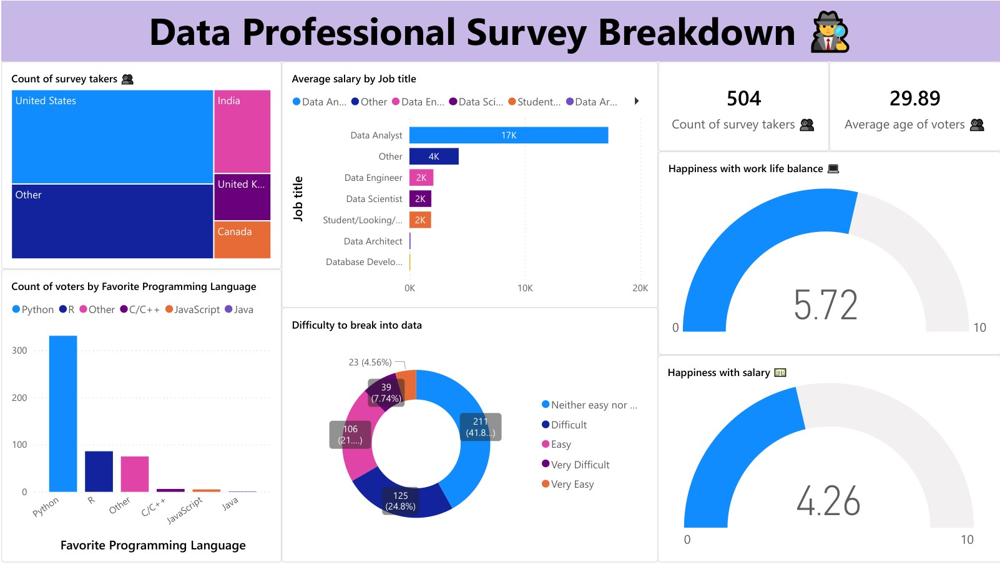

# 📊 Data Professional Survey Analysis - Power BI Dashboard


Interactive Power BI dashboard analyzing survey responses from 500+ data professionals worldwide about their careers, salaries, and job satisfaction.



## 🎯 What This Project Shows

This dashboard analyzes real survey data from data professionals to understand:

- What jobs people have in data field
- How much money they make
- Which programming languages they prefer
- How happy they are with their work


## 📋 Survey Details

- **Total Responses**: 504 data professionals
- **Average Age**: 29.89 years
- **Countries**: USA, India, UK, Canada, and others
- **Job Titles**: Data Analyst, Data Engineer, Data Scientist, Students
- **Industries**: Healthcare, Finance, Technology, and more


## 📊 Dashboard Components

### 1. **Geographic Distribution**

- Map showing survey responses by country
- USA has the most respondents
- Good representation from India and other countries


### 2. **Job Titles \& Salaries**

- Data Analyst: Most common role
- Data Engineer: Higher average salary
- Data Scientist: Popular career choice
- Students: Learning and transitioning


### 3. **Programming Language Preferences**

- Python: Most popular (300+ votes)
- R: Second choice (100+ votes)
- Other languages: JavaScript, C/C++, Java


### 4. **Career Transition Analysis**

- Shows how difficult it is to break into data
- 24.8% find it "Difficult"
- 7.74% say "Very Difficult"
- 41.8% find it "Neither easy nor difficult"


### 5. **Job Satisfaction Metrics**

- Work-Life Balance: 5.72/10 average
- Salary Satisfaction: 4.26/10 average
- Shows areas where data professionals want improvement


## 🔍 Key Insights

### Career Entry

- Most people find it challenging to get into data careers
- Breaking into data field requires effort and persistence


### Popular Skills

- Python is the most in-demand programming language
- R is important for statistical analysis
- Multiple programming skills are valuable


### Job Satisfaction

- Work-life balance is moderate (5.7/10)
- Salary satisfaction is lower (4.3/10)
- Room for improvement in compensation


### Demographics

- Average age is around 30 years
- Global representation with USA leading
- Mix of experienced professionals and students


## 🛠️ Power BI Skills Used

- **Data Import**: Connected Excel data source
- **Data Cleaning**: Prepared survey responses
- **Visualizations**: Maps, bar charts, pie charts, gauges
- **Interactive Filters**: Country, job title filtering
- **Dashboard Design**: Professional layout
- **DAX Calculations**: Average calculations, percentages
- **Custom Formatting**: Color themes and styling


## 📁 Project Files

```
📦 data-professional-survey-powerbi/
├── 📄 README.md                    (This file)
├── 📊 dashboard.pbix               (Power BI file)
├── 📋 dataset.xlsx                 (Survey data)
└── 📄 dashboard_export.pdf         (PDF version for viewing)
```


## 📱 How to View

### Option 1: Power BI File

1. Download `dashboard.pbix`
2. Open with Power BI Desktop (free)
3. Explore interactive features

### Option 2: PDF Export

1. Download `dashboard_export.pdf`
2. View static version of dashboard
3. See all charts and insights

## 💡 What This Project Demonstrates

- **Survey Analysis**: Understanding professional trends
- **Data Visualization**: Creating clear, meaningful charts
- **Business Intelligence**: Turning data into insights
- **Dashboard Design**: User-friendly interface
- **Data Storytelling**: Presenting findings effectively


## 🎓 Skills Showcased

- ✅ Power BI Dashboard Development
- ✅ Data Analysis \& Interpretation
- ✅ Survey Data Processing
- ✅ Interactive Visualization Design
- ✅ Business Intelligence Reporting
- ✅ Professional Presentation


## 🔮 Potential Applications

- **HR Teams**: Understand data job market
- **Career Guidance**: Help people plan data careers
- **Salary Benchmarking**: Compare compensation
- **Skill Planning**: Identify important technologies
- **Industry Research**: Market insights

***

**Created by**: [sankaran-s2001](https://github.com/sankaran-s2001)
**Tools Used**: Power BI, Excel
**Project Type**: Business Intelligence Dashboard

*Note: PDF export available for easy viewing without Power BI software*

## ✉️ Contact

**Sankaran S**  
[](https://github.com/sankaran-s2001) [](https://www.linkedin.com/in/sankaran-s21/) [](mailto:sankaran121101@gmail.com)

*Exploring global data professional trends with an interactive Power BI dashboard — uncovering insights on salaries, skills, and career paths.*
